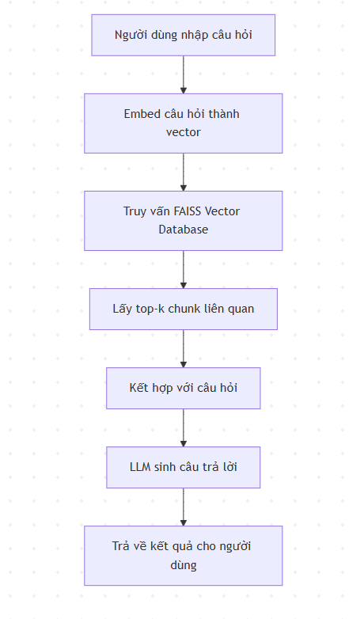

# RAG Chatbot VNPT

## 1. Pipeline Flow
Hệ thống RAG Chatbot được thiết kế theo luồng xử lý sau:



**Mô tả ngắn gọn các bước:**
1. Người dùng nhập câu hỏi.
2. Câu hỏi được encode thành vector embedding.
3. Truy vấn FAISS để lấy các chunk liên quan.
4. Kết hợp các chunk với câu hỏi để tạo ngữ cảnh truy hồi.
5. Mô hình ngôn ngữ lớn (LLM) sinh câu trả lời dựa trên ngữ cảnh.

---

## 2. Data Processing

### 2.1 Thu thập và lọc dữ liệu
- Sử dụng dataset **`VTSNLP/vietnamese_curated_dataset`** từ HuggingFace.
- Lọc theo các chủ đề:
  - Science
  - Computers_and_Electronics
  - Internet_and_Telecom
  - Finance
  - Law_and_Government
  - Health
  - …
- Mỗi topic lấy khoảng **2.000 mẫu văn bản** để cân bằng dữ liệu giữa các miền kiến thức.

### 2.2 Chunking văn bản
- Mỗi văn bản được chia thành các chunk để phục vụ truy hồi ngữ nghĩa.
- **Chunk size:** 512 từ
- **Overlap:** 50 từ
- Phương pháp: chia theo câu, đảm bảo liền mạch ngữ nghĩa.

### 2.3 Embedding
- Chuyển các chunk thành vector embedding bằng mô hình embedding ngôn ngữ (**sentence embedding**).
- Quá trình embedding được thực hiện **offline** và lưu trữ để tái sử dụng.
- Giảm tải tính toán cho inference.

---

## 3. Resource Initialization

### 3.1 Vector Database
- Sử dụng **FAISS (CPU)** để lưu trữ các embedding vector.
- Index được build một lần và lưu ra file (`faiss_index.bin`).
- Metadata đi kèm (`metadata.json`) lưu thông tin text gốc tương ứng với vector.

### 3.2 Khởi tạo RAG System
- Code chính: `main.py`
- Cấu hình RAG và VNPT AI API được lưu trong `api-keys.json`.
- Khi khởi chạy:
  1. Load FAISS index.
  2. Khởi tạo VNPTEmbedder để tạo embedding cho câu hỏi.
  3. Khởi tạo RAGSystem để thực hiện truy hồi ngữ nghĩa.
- Hệ thống kiểm tra FAISS index tồn tại, nếu không có sẽ cảnh báo và vô hiệu hóa RAG.

### 3.3 API và Quota Management
- Mỗi request gửi tới **VNPT AI API** có kiểm soát:
  - `max_requests_per_hour` và `max_requests_per_day`
  - Delay giữa các request (`request_delay`)
- Quota được ghi nhận và kiểm tra tự động trước mỗi request.

### 3.4 Inference Pipeline
1. Nhận câu hỏi từ dataset hoặc người dùng.
2. Nếu RAG được bật:
   - Encode câu hỏi thành embedding vector.
   - Truy vấn FAISS lấy top-k chunk.
   - Tạo ngữ cảnh truy hồi cho LLM.
3. Chuẩn bị payload và gửi tới VNPT AI API.
4. Nhận kết quả, làm sạch và trả về **một ký tự duy nhất** (A/B/C/D/...).

---

## 4. Chạy hệ thống

```bash
python main.py
```

- Kết quả lưu vào `submission.csv`.
- Thời gian xử lý từng câu hỏi lưu vào `submission_time.csv`.
- Nếu RAG không khả dụng, hệ thống vẫn có thể trả lời dựa trên VNPT AI LLM.

---

## 5. Dependencies
- Python >= 3.8
- requests
- tqdm
- FAISS (`faiss-cpu`)
- json, csv, os, time, datetime (có sẵn)
- Các module nội bộ: `embedder.py`, `rag_system.py`